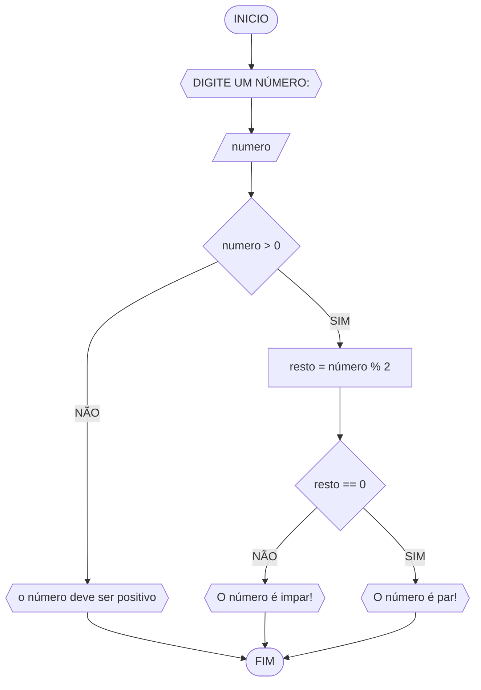

# UNIFOR
**Disciplina:** Raciocínio lógico algorítmico
**Orientador:** Prof. Ricardo Carubbi

## Lista 1 de exercícios

### Exercício 03
Represente, em fluxograma e pseudocódigo um algoritmo para determinar se um número inteiro e positivo é par ou impar.

#### Fluxograma


```
ALGORITIMO verifica_par_impar
DECLARE numero, resto INTEIRO
ESCREVA "Digite um Número"
LEIA número
Se número >ou= 0 ENTAO
    Resto = número % 2
    SE resto == 0 ENTAO
        ESCREVA "O número é par!"
        SENÃO
        ESCREVA "O número é impar!"
        SENÃO
        ESCREVA "O número deve ser positivo!"
FIM_ALGORITIMO
```
